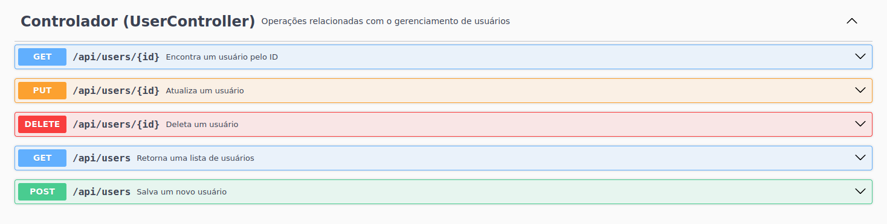

# DIO - Projeto Spring Boot com Padrões de Projeto



Este projeto foi desenvolvido com o objetivo de explorar alguns padrões de projeto utilizando Java e Spring Boot. O projeto inclui as implementações dos padrões **Singleton**, **Strategy**, **Facade** e **Adapter**, além de integrar com um banco de dados H2 e uma API externa (ViaCEP).

---

## Tecnologias Utilizadas

- **Java 17**
- **Spring Boot 3**
  - Spring Web
  - Spring Data JPA
  - Spring OpenFeign
  - H2 Database
  - Lombok
  - Springdoc OpenAPI

## Padrões de Projeto Implementados

### Singleton

Utilizado para garantir que uma única instância de um bean seja criada e gerenciada pelo Spring. Implementado com a anotação `@Autowired`.

### Strategy

Implementado através da interface `UserService` e sua implementação `UserServiceImpl`.

### Facade

Abstrai a integração com o banco de dados H2 e a API externa do ViaCEP, simplificando a interface para o cliente.

### Adapter

Adapta a resposta da API ViaCEP para um objeto `Address` que utiliza menos informações de endereço.

---

## Como Executar

1. Clone o repositório:

   ```bash
   git clone https://github.com/correa-coder/dio-gof-springboot.git
   ```

2. Navege até o repositório do projeto:

   ```bash
   cd dio-gof-springboot
   ```

3. Execute o projeto usando Maven:
   ```bash
   mvn spring-boot:run
   ```

---

## Documentação da API

A documentação da API pode ser acessada através do endpoint `localhost:8080/swagger-ui.html` após iniciar a aplicação.

---

## Licença

Este projeto está licenciado sobre a licença MIT. Veja o arquivo `LICENCE` para mais detalhes.
